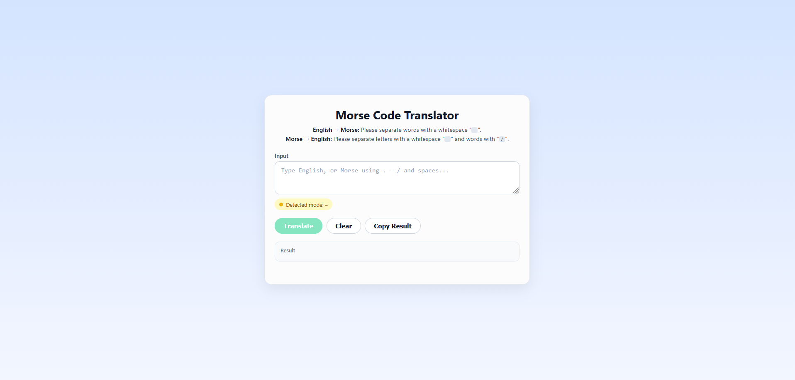

# Morse Code Translator

A Morse code translator built during week 5 of my software development course at \_nology.

The app converts English ↔ Morse code, supporting full words, numbers, and complete sentences.

Unit tests are written in Jest to ensure accuracy and reliability.

Responsive on PC or mobile.

## Features

- Translate English to Morse
- Translate Morse to English
- Fully tested with Jest
- Responsive design for desktop and mobile
- Clean, modern UI with auto-detect translation mode

## Instructions

Type your text or Morse code into the input box.

The translator will automatically detect the input type (English or Morse).

Click **Translate** to convert it, or use **Clear** and **Copy Result** as needed.

### Formatting Rules

English → Morse: Separate words with a whitespace " ".

Morse → English: Separate letters with a whitespace " " and words with a forward slash "/".

### Languages/Frameworks Used

- HTML 5
- CSS 3/SCSS
- Javascript (ES6)
- Jest (unit testing)

## Development

### Install dependencies

npm install

### Run tests

npm test
